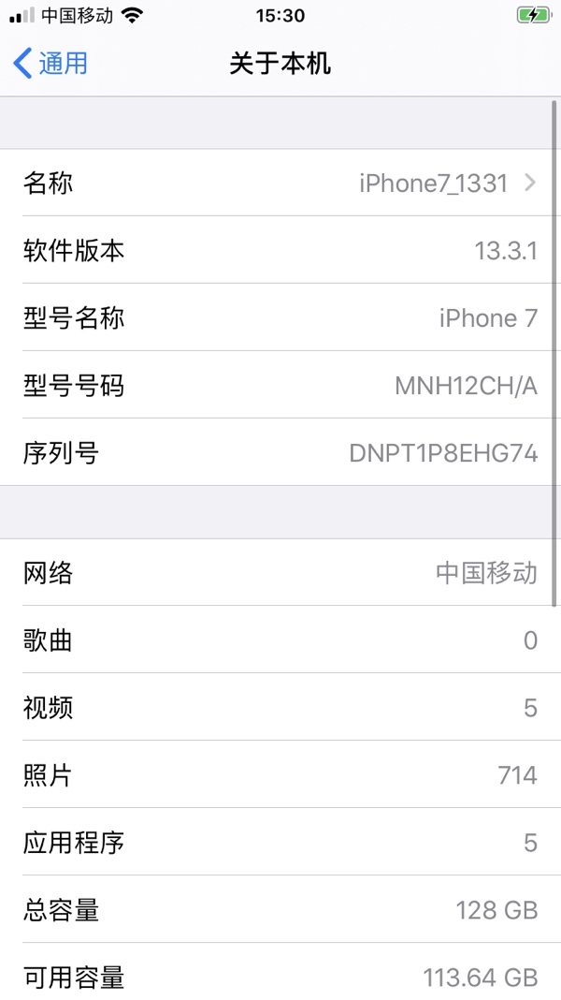
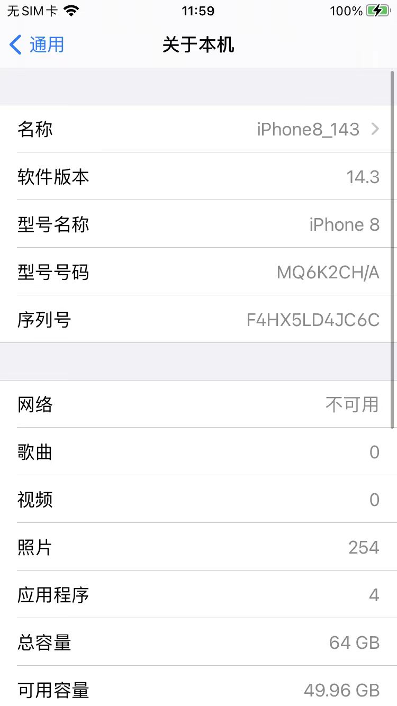
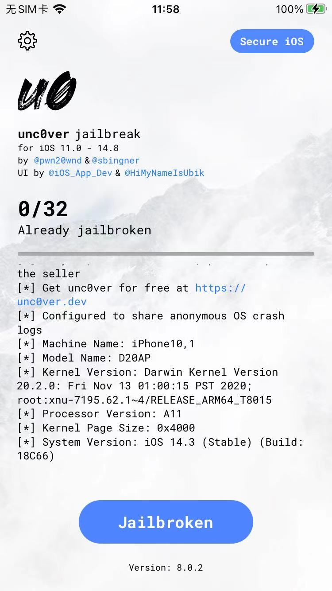

# 用unc0ver越狱自动实现可调试

* 部分机型用[unc0ver](https://book.crifan.org/books/ios_re_iphone_jailbreak/website/doing_jailbreak/do_jailbreak/unc0ver.html)越狱后的自带app可调式
  * 说明
    * 实测部分机型
      * `iOS 13.3.1`的`iPhone7`
        * 
      * `iOS 14.3`的`iPhone8`
        * 
    * 在用`unc0ver`
      * 最新版`v8.0.2`
        * 
    * 越狱后，确认是自动拥有全局的`app可调试`
* 优点
  * 无需额外操作，即可支持可调试
* 缺点
  * 之前unc0ver越狱的iPhone，好像不是自动支持可调试？
