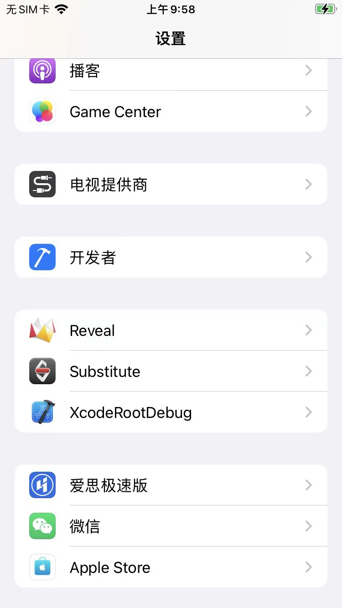
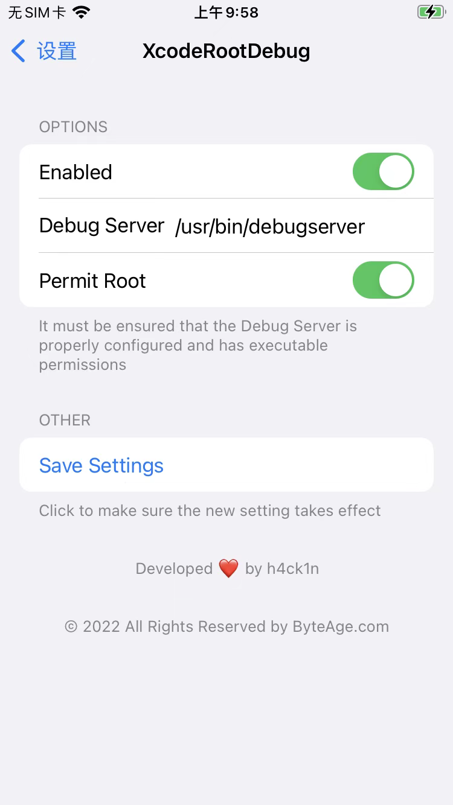

# 借助插件实现可调式

* 借助插件实现可调式
  * XcodeRootDebug
    * Github
      * https://github.com/lemon4ex/XcodeRootDebug
    * Repo源
      * https://repo.byteage.com
    * 说明
      * 之前在iOS15中用过：不起效果
        * 不过对于`< iOS 15`，应该是可以工作的
    * 前提
      * 把重签名加了可调试权限的debugserver放到iPhone中的对应位置
        * 位置举例
          * `/usr/bin/debugserver`
        * 关于如何重签名debugserver，详见
          * [确保debugserver权限 · iOS逆向调试：debugserver+lldb (crifan.org)](https://book.crifan.org/books/ios_re_debug_debugserver_lldb/website/debugserver_lldb_debug/proper_entitlemets.html)
    * 安装后
      * `设置`中能看到`XcodeRootDebug`
        * 
      * 进入后可以配置XcodeRootDebug的参数
        * 
