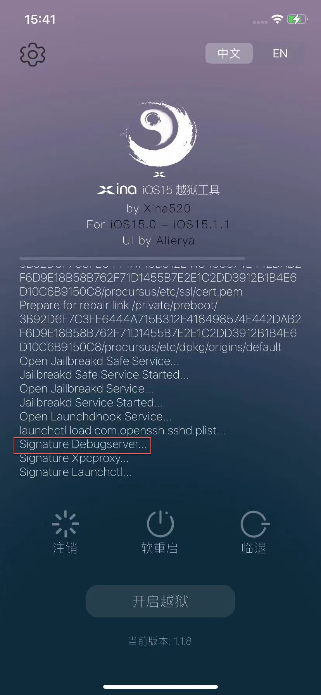
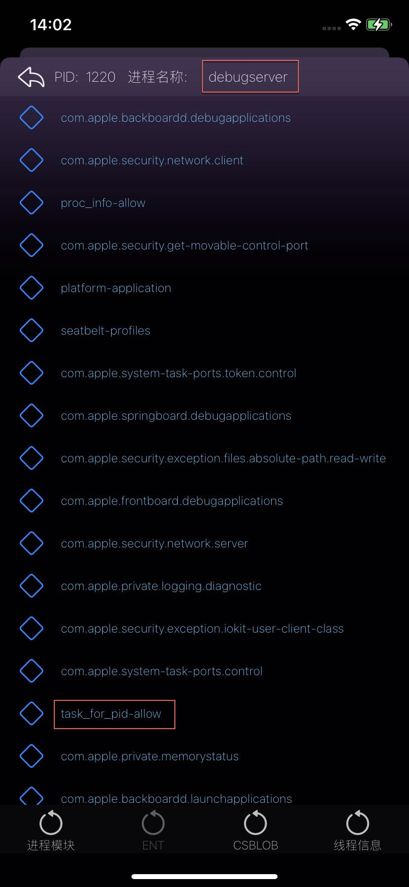

# 用XinaA15越狱自动实现可调试

* [XinaA15](https://book.crifan.org/books/ios_re_ios15_jailbreak/website/xinaa15/)越狱后：自带app可调试
  * 说明
    * 关键点
      * 越狱期间
        * `Signature Debugserver`=`重签名Debugserver`
          * 
      * 越狱后
        * 进程管理器中的`debugserver`的entitlement权限中，就有了：`task_for_pid-allow`
        * 
      * -> 给debugserver加上可调试权限 -》 可以调试任意app/进程了
  * 缺点
    * 只适用于：A12+芯片的iPhone机型
      * 注：XinaA15只支持`A12+`的机型
