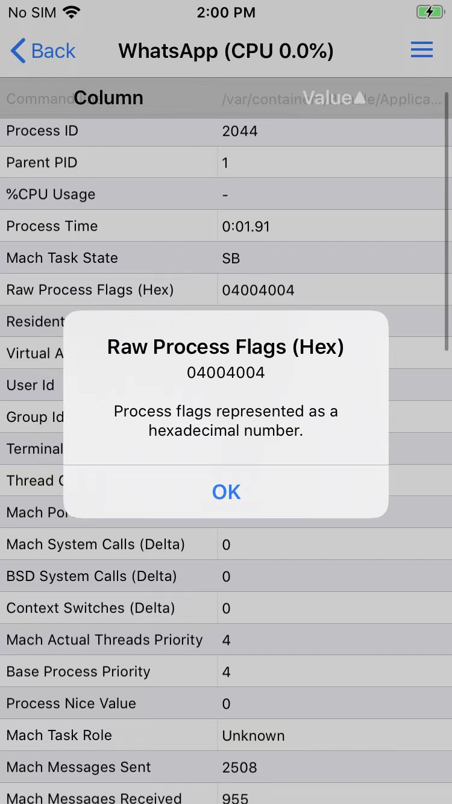

# 可调试debuggable的底层机制和原理

## `task_for_pid`函数

根据前面的报错细节中的`Look in the console messages (Console.app)`所示，去查看`Console.app`=`控制台`中日志，往往可以看到相关错误细节：


```bash
默认    21:37:03.838148+0800    debugserver    error: [LaunchAttach] MachTask::TaskPortForProcessID task_for_pid(15266) failed: ::task_for_pid ( target_tport = 0x0203, pid = 15266, &task ) => err = 0x00000005 ((os/kern) failure)
默认    21:37:03.838202+0800    debugserver    1 +0.000000 sec [3bb1/0103]: error: ::task_for_pid ( target_tport = 0x0203, pid = 15266, &task ) => err = 0x00000005 ((os/kern) failure) err = ::task_for_pid ( target_tport = 0x0203, pid = 15266, &task ) => err = 0x00000005 ((os/kern) failure) (0x00000005)
```

核心错误

* debugserver
  * error: [LaunchAttach] MachTask::TaskPortForProcessID task_for_pid(15266) failed: ::task_for_pid ( target_tport = 0x0203, pid = 15266, &task ) => err = 0x00000005 ((os/kern) failure)

即：

* 核心原因
  * `task_for_pid()`返回失败 -》无法获取task
* 解决办法
  * 能想办法给被调试的app加上`task_for_pid-allow`（和`get-task-allow`）的权限entitlement即可
    * 但是无法直接修改`debugserver`去加权限
      * 因为这个`/Developer/usr/bin/debugserver`
        * 最早来源是：`DeveloperDiskImage.dmg`
      * 是挂载到`Ramdisk`中 -> 是只读的
        * 所以无法简单的直接修改
    * 所以只能用其他办法
      * 详见后续内容
        * [如何实现](../app_debuggable/how_implement/README.md)

## `csflags`中的`CS_GET_TASK_ALLOW`

而决定进程函数`task_for_pid()`返回是否成功，再底层决定因素是：进程的`csflags`中的`CS_GET_TASK_ALLOW`

* 举例
  * `WhatsApp`的进程的flag
    * 
      * 含义解释
        * `0x04000000 = CS_PLATFORM_BINARY`
        * `0x00004000 = CS_ENTITLEMENTS_VALIDATED`
        * `0x00000004 = CS_GET_TASK_ALLOW`
      * 具体定义详见
        * [进程csflags定义](../appendix/process_csflags.md)
* 说明
  * 不过，目前也发现过：iOS进程中csflags中有CS_GET_TASK_ALLOW也还是无法被调试
  * 所以底层相关细节，暂时不是完全清楚，待深究。
