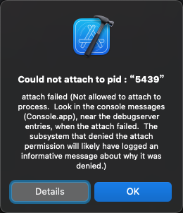

# 为何要可调试debuggable

iOS逆向期间，尝试用Xcode去调试iPhone中的目标（app或二进制）时，如果目标不可调试，则会报错：

`Not allowed to attach to process`

所以被调试目标（app或二进制），必须：可调试=`debuggable`，才可以顺利调试。

## 报错举例

```bash
Could not attach to pid : “5439”

attach failed (Not allowed to attach to process.  Look in the console messages (Console.app), near the debugserver entries, when the attach failed.  The subsystem that denied the attach permission will likely have logged an informative message about why it was denied.)
```



* Details
  * 

```bash
Details

Could not attach to pid : “5439”
Domain: IDEDebugSessionErrorDomain
Code: 3
Failure Reason: attach failed (Not allowed to attach to process.  Look in the console messages (Console.app), near the debugserver entries, when the attach failed.  The subsystem that denied the attach permission will likely have logged an informative message about why it was denied.)
User Info: {
    DVTErrorCreationDateKey = "2023-03-02 09:53:45 +0000";
    DVTRadarComponentKey = 855031;
    IDERunOperationFailingWorker = DBGLLDBLauncher;
    RawUnderlyingErrorMessage = "attach failed (Not allowed to attach to process.  Look in the console messages (Console.app), near the debugserver entries, when the attach failed.  The subsystem that denied the attach permission will likely have logged an informative message about why it was denied.)";
}
--

Analytics Event: com.apple.dt.IDERunOperationWorkerFinished : {
    "device_model" = "iPhone10,1";
    "device_osBuild" = "15.0 (19A346)";
    "device_platform" = "com.apple.platform.iphoneos";
    "launchSession_schemeCommand" = Run;
    "launchSession_state" = 1;
    "launchSession_targetArch" = arm64;
    "operation_duration_ms" = 105483;
    "operation_errorCode" = 3;
    "operation_errorDomain" = IDEDebugSessionErrorDomain;
    "operation_errorWorker" = DBGLLDBLauncher;
    "operation_name" = IDEiPhoneRunOperationWorkerGroup;
    "param_consoleMode" = 0;
    "param_debugger_attachToExtensions" = 0;
    "param_debugger_attachToXPC" = 1;
    "param_debugger_type" = 3;
    "param_destination_isProxy" = 0;
    "param_destination_platform" = "com.apple.platform.iphoneos";
    "param_diag_MainThreadChecker_stopOnIssue" = 0;
    "param_diag_MallocStackLogging_enableDuringAttach" = 0;
    "param_diag_MallocStackLogging_enableForXPC" = 0;
    "param_diag_allowLocationSimulation" = 0;
    "param_diag_gpu_frameCapture_enable" = 3;
    "param_diag_gpu_shaderValidation_enable" = 0;
    "param_diag_gpu_validation_enable" = 1;
    "param_diag_memoryGraphOnResourceException" = 0;
    "param_diag_queueDebugging_enable" = 1;
    "param_diag_runtimeProfile_generate" = 0;
    "param_diag_sanitizer_asan_enable" = 0;
    "param_diag_sanitizer_tsan_enable" = 0;
    "param_diag_sanitizer_tsan_stopOnIssue" = 0;
    "param_diag_sanitizer_ubsan_stopOnIssue" = 0;
    "param_diag_showNonLocalizedStrings" = 0;
    "param_diag_viewDebugging_enabled" = 1;
    "param_diag_viewDebugging_insertDylibOnLaunch" = 1;
    "param_install_style" = 2;
    "param_launcher_UID" = 2;
    "param_launcher_allowDeviceSensorReplayData" = 0;
    "param_launcher_kind" = 0;
    "param_launcher_style" = 99;
    "param_launcher_substyle" = 256;
    "param_runnable_appExtensionHostRunMode" = 0;
    "param_runnable_type" = 0;
    "param_testing_launchedForTesting" = 0;
    "param_testing_suppressSimulatorApp" = 0;
    "param_testing_usingCLI" = 0;
    "sdk_canonicalName" = "iphoneos15.2";
    "sdk_osVersion" = "15.2";
    "sdk_variant" = iphoneos;
}
--


System Information

macOS Version 11.7.3 (Build 20G1116)
Xcode 13.2.1 (19586) (Build 13C100)
Timestamp: 2023-03-02T17:53:45+08:00
```
