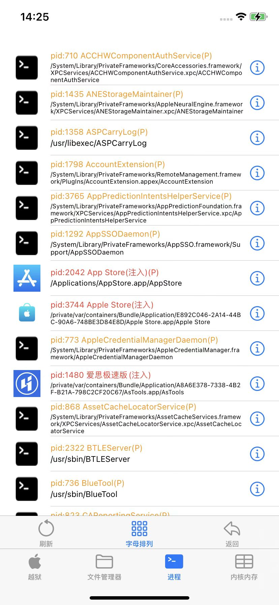
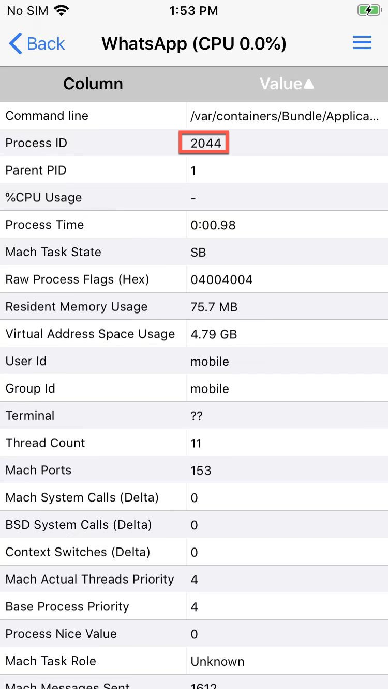

# 如何查看进程PID

* 如何查看进程PID
  * 用`ssh`中`ps`查看PID
    * 举例
      * akd
        ```bash
        iPhone11-151:~ root# ps -A | grep akd
          125 ??         0:36.25 /System/Library/PrivateFrameworks/AuthKit.framework/akd
          352 ??         0:01.53 /var/bin/jailbreakd_safe
          353 ??         0:07.82 /var/bin/jailbreakd
        14933 ttys001    0:00.01 grep akd
        ```
        -> akd的PID是`125`
  * 用`frida-ps`查看PID
    ```bash
    crifan@licrifandeMacBook-Pro  ~/dev/dev_src/ios_reverse/dumpdecrypted/stefanesser/dumpdecrypted   master ●  frida-ps -U | grep Store
    2042  App Store
    3744  Apple Store
    1559  TrollStore
    ```
    -> `Apple Store`的PID是`3744`
  * 用越狱后的工具查看
    * `XinaA15`->`进程`
      * 
    * [CocoaTop64](https://book.crifan.org/books/ios_re_common_tweak/website/process/cocoatop64/)
      * 
