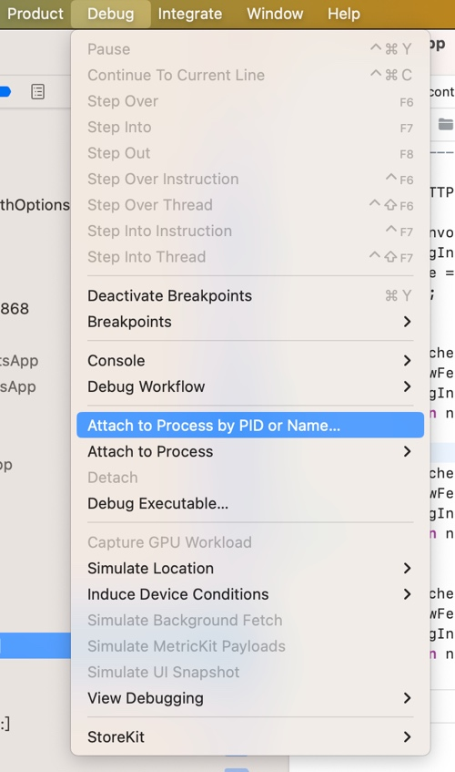
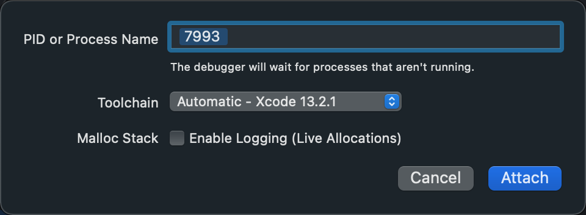
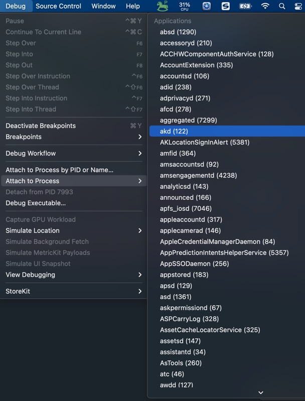

# 以Attach挂载模式启动调试

* Attach模式=挂载模式
  * 前提：已经启动=app正在运行
  * 方式1：手动输入PID或Name
    * 步骤：`Xcode`->`Debug`->`Attach to Process by PID or name`->输入`PID`或`name`
      * 图
        * 
    * 方式1：Name
      * 举例：`WhatsApp`
        * 
    * 方式2：PID
      * 举例：`Preferences`的PID=`7993`
        * 
      * 说明
        * 关于如何查看进程PID，详见：[查看进程PID](../appendix/check_pid.md)
  * 方式2：从进程列表中点击选择
    * 步骤：`Xcode`->`Debug`->`Attach to Process`->等待（一会，即可）显示出进程的列表-》点击选择对应进程
    * 举例
      * akd
        * 
