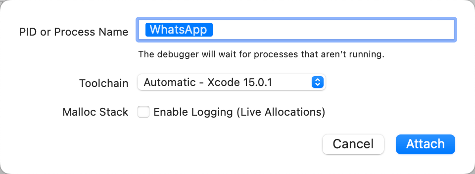
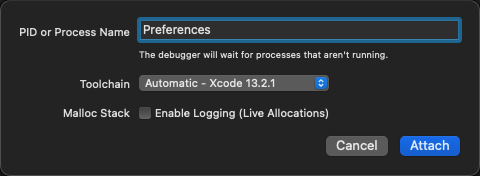
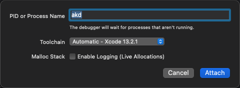
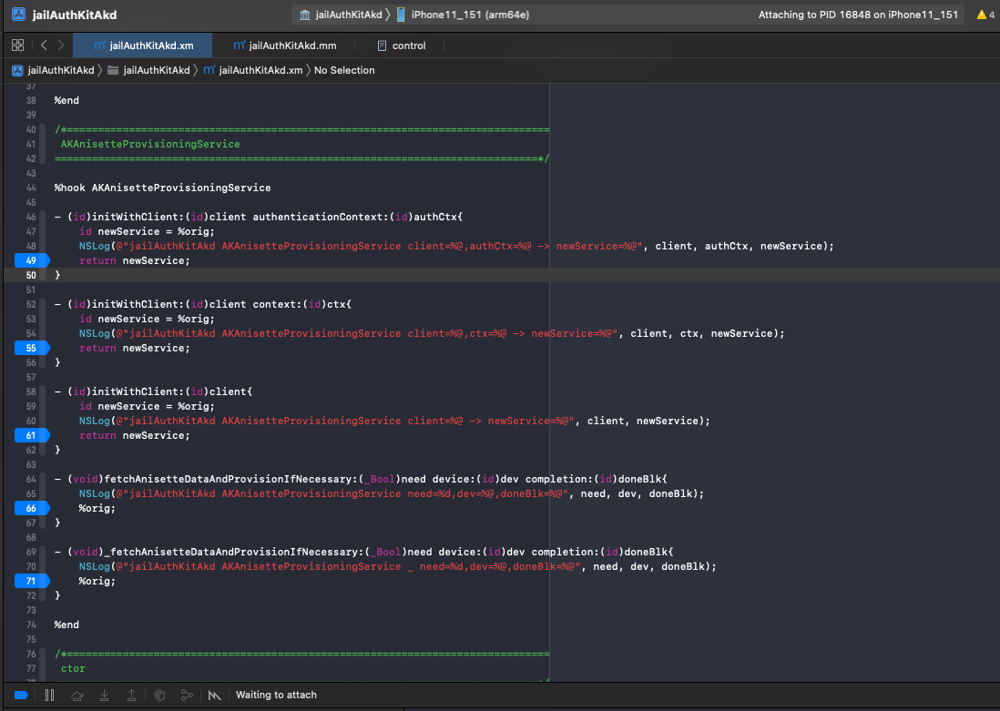
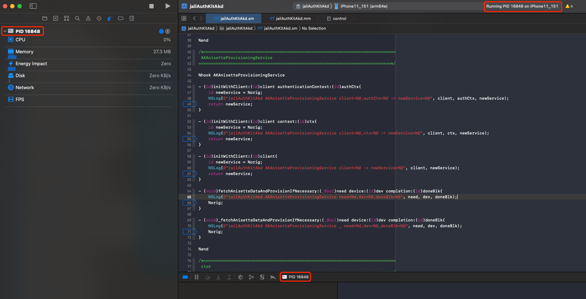

# 以Spawn孵化模式启动调试

* Spawn模式=孵化模式
  * 用途：
    * 用于app启动阶段时的相关逻辑
      * 举例
        * 调试反越狱检测
        * 调试app首次启动初始化相关过程
          * 比如app中只初始化一次的相关代码逻辑
            * 举例
              * WhatsApp中的初始化创建WAUUID、WAFBUUID等相关逻辑
  * 前提：Xcode中可以通过name找到被调试的app或二进制
  * 步骤：
    * Xcode中
      * 操作：`Xcode`->`Debug`->`Attach to Process by PID or name`->输入`name`
        * 说明：Name是app或二进制文件的name
        * 举例
          * WhatsApp这个app的主入口二进制：`WhatsApp`
            * 
          * Preferences的二进制名称：`Preferences`
            * 
          * akd的二进制名称：`akd`
            * 
      * Xcode中会显示：正在等待挂载
        * 对于PID：`Attaching to PID xxx`
          * 举例
            * PID=16848
              * 
          * 说明
            * 关于如何查看进程PID，详见：[查看进程PID](../appendix/check_pid.md)
        * 对于Name：`Waiting to attach to xxx`
          * 举例
            * akd
              * 
    * iPhone中：
      * 确保进程运行
        * （手动点击）启动app
          * 点击app桌面图标
            * 举例
              * WhatsApp
                * 
        * 或：以某种方式，触发二进制服务进程加载
          * 举例
            * akd
              * 点击iOS系统的`设置`=`Preferences`=包名`com.apple.Preferences`
                * 内部会触发XPC的服务，去请求到`akd`，从而触发启动`akd`进程
                  * 比如，Apple ID账号登录
                    * 
              * 说明：
                * akd完整路径：`/System/Library/PrivateFrameworks/AuthKit.framework/akd`
    * Xcode中：
      * 说明：需要稍等一段时间，才能挂载上
        * 一般都很快：大概几秒
        * 偶尔：很多秒（之后，才能挂载上，注意此时要多等一会）
      * 即可挂载成功
        * 具体现象
          * 描述
            * 右下角：调试窗口：显示出进程PID值/Name
            * 右上角：状态信息显示：Running PID值/Name on iPhone
            * 左上角：Debug Navigator中显示出PID值/Name和当前硬件信息：CPU、Memory等等
          * 图
            * 对于PID
              * 
            * 对于Name
              * 
      * 然后即可正常（Spawn方式去）调试
