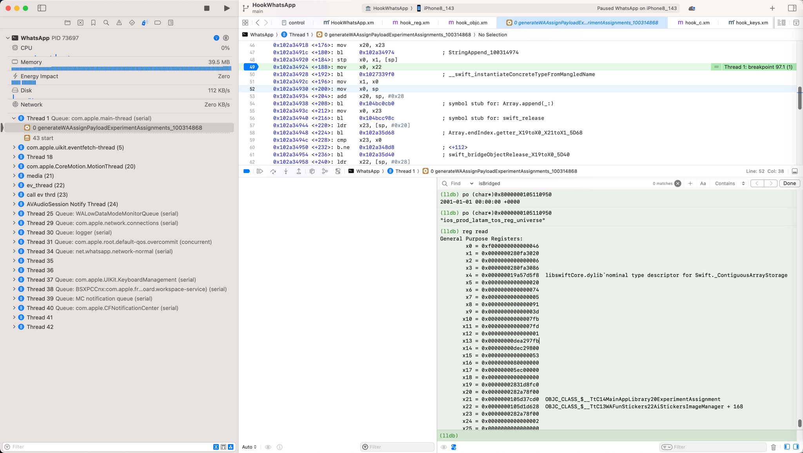
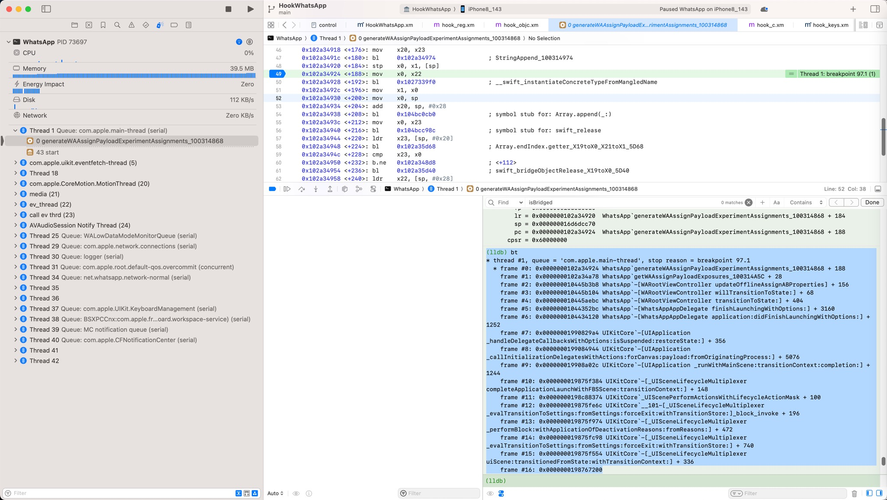
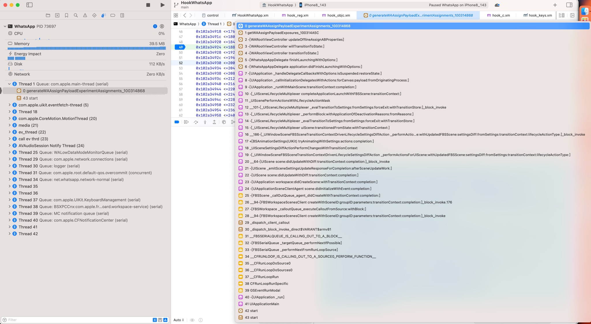
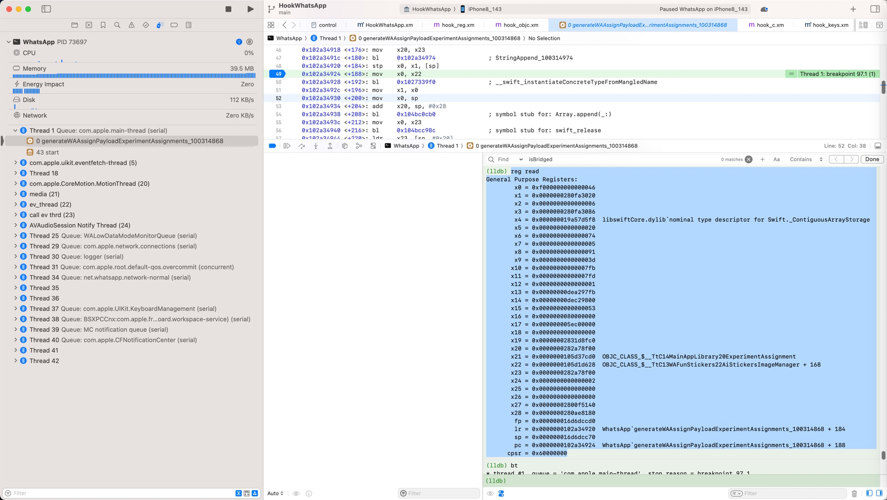
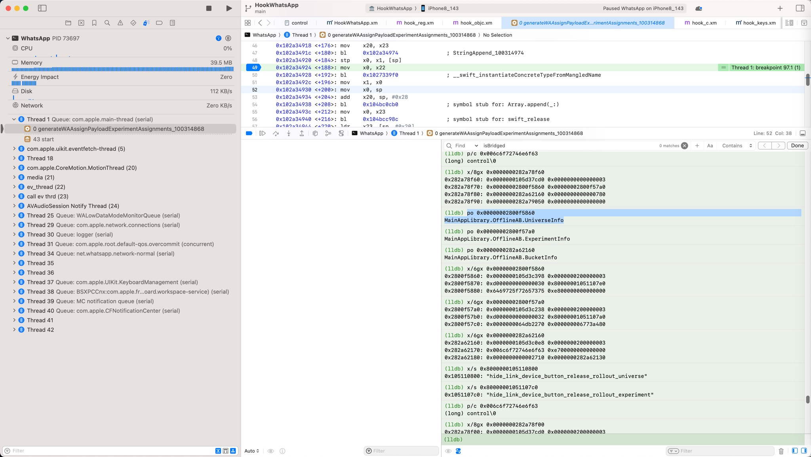
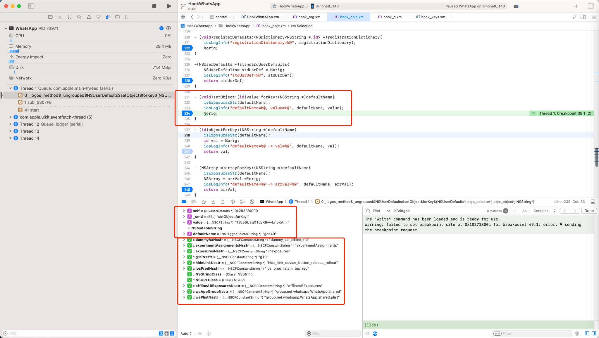
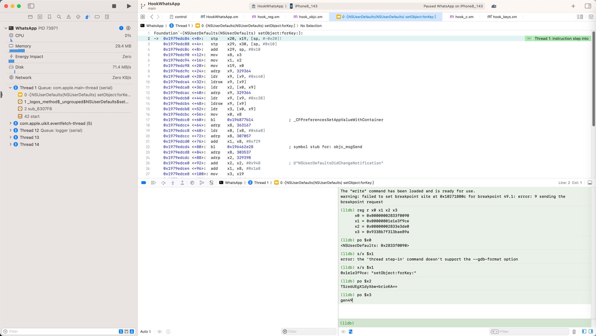
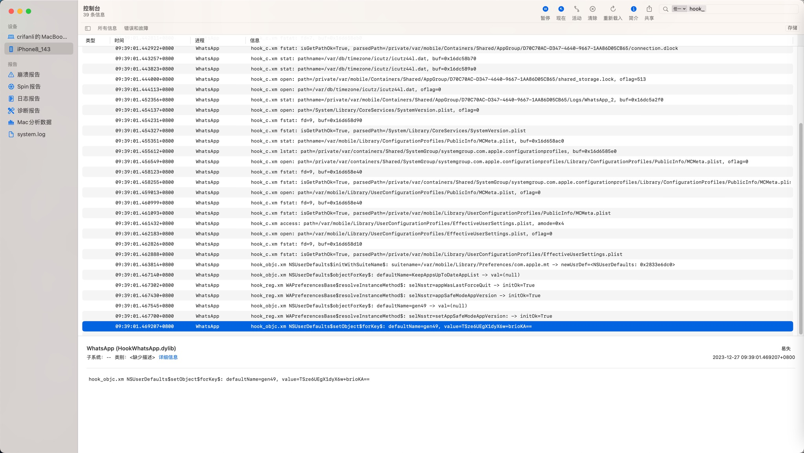

# 效果举例

此处举例说明iOS逆向的`Xcode+iOSOpenDev`的图形界面调试的效果：

* 方便查看和调试
  * Xcode
    * Xcode中查看汇编代码
      * 
    * 查看函数调用堆栈
      * 除了`lldb`**命令行**中的`bt`
        * 
      * 还可以GUI**图形界面**中查看：
        * 
  * lldb中
    * 查看寄存器变量
      * 
    * 用po查看变量的值
      * 
* 对于hook代码
  * 用iOSOpenDev写插件代码，加断点，实时调试，触发断点后的）效果
    * 能看到各种参数值和当前变量的值，甚至包括全局变量的值
      * 
  * 对于hook代码的`%orig`，（多次）`Ctrl+F7`后，可以进入对应的Xcode汇编代码
    * 
* 辅助
  * Console.app=控制台
    * 另外，hook代码中加上的`os_log`日志打印，还可以单独在`Console.app`中看到：
      * 

-> 如此即可实现：用Xcode去方便的、深入的，调试每一行代码，以及搞懂hook代码和汇编代码的底层逻辑和细节。
